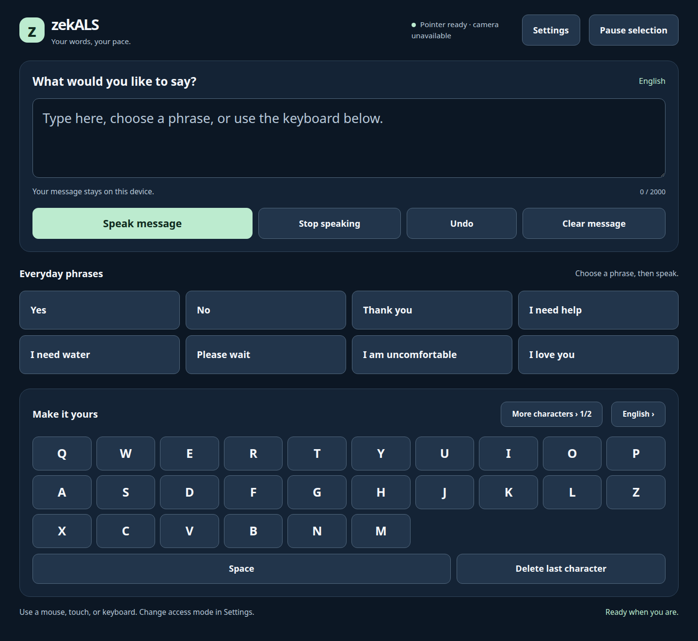

# zekALS

**Accessible communication, at the user's pace.**

zekALS is a local-first communication application for people with ALS and others
who benefit from alternative input. Compose messages using touch, a keyboard,
pointer dwell, a single switch, or optional experimental webcam tracking, then
speak them with a device voice or a local neural speech engine.



## Capabilities

- Large, labeled controls, high contrast, adjustable text, pause, undo and clear
  feedback. Communication remains available when the camera is disconnected.
- English, French, Simplified Chinese, Italian and Sinhala packs; Greek retained.
  Packs include phrases, character boards, interface text and speech metadata.
- Installed offline voices by default; optional Piper neural speech. Voice/model
  availability varies by language; a Sinhala neural model is not bundled.
- Bounded camera processing, low/balanced/high profiles, normalized coordinates,
  calibration, tracking-loss cancellation and an optional dependency-free Rust filter.
- CPU-first operation on x86_64 and ARM64 systems. Optional GPU and Intel NPU
  provider adapters use compatible models and runtimes, with documented fallback.
- A small Node.js server, one browser origin, local processing, no required API keys,
  no message broadcast to other users and no privileged default container.

## Start in minutes

Install Node.js 22 or newer, then:

```bash
git clone https://github.com/Zektopic/zekals-containerized.git
cd zekals-containerized
npm ci --prefix za-frontend
npm start --prefix za-frontend
```

Open **http://localhost:3000**. The basic interface needs no Python, Rust, webcam,
GPU, or internet connection after dependencies are installed. For containers:

```bash
docker compose up --build -d
```

Open **http://localhost:8080**. Camera tracking and neural speech are optional
installations; follow the [setup guide](docs/getting-started.md).

## Documentation

| Guide | Contents |
| --- | --- |
| [Getting started](docs/getting-started.md) | Native, Windows, Docker and Raspberry Pi setup |
| [Accessibility](docs/accessibility.md) | Controls, scanning, dwell and calibration |
| [Speech and languages](docs/speech-and-languages.md) | Neural voices, IMEs and language-pack example |
| [Hardware and performance](docs/hardware.md) | CPU/GPU/NPU matrix, profiles, limitations and measurements |
| [Architecture](docs/architecture.md) | Services, protocol, data flow and native boundary |
| [Security and privacy](docs/security.md) | Trust boundaries, deployment and reporting |
| [Development](docs/development.md) | Tests, dependencies, contribution and release process |
| [Troubleshooting](docs/troubleshooting.md) | Camera, speech, access and installation problems |
| [Migration](docs/migration.md) | Changes from the original intern-project version |
| [Roadmap](docs/roadmap.md) | Review sequence and future improvements |
| [Validation](docs/validation.md) | What was tested and what still needs devices/users |

The native Android companion is [zekals-android](https://github.com/Zektopic/zekals-android),
with its own C++/JNI input processing, offline speech and documentation.

## Project status

This modernization provides an engineering foundation requiring real-user and
physical-device validation;
webcam tracking is experimental. Automated accessibility checks do not establish
complete accessibility conformance. GPU/NPU compatibility is conditional, and
performance on every device is not guaranteed. The measured Rust FFI filter did
not improve this host's per-sample latency; see the recorded benchmark.

Code is available under the [MIT License](LICENSE). Dependencies, model files and
voices retain their own licenses; see [third-party notices](docs/third-party.md).
