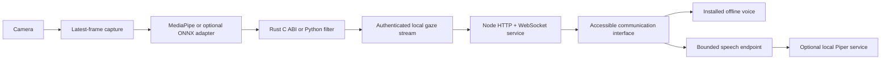

# Architecture



## Service boundaries

`za-frontend/server.js` serves a static application, discovers validated language
packs, exposes health/config endpoints, and forwards normalized gaze samples over
`/ws`. Its production JavaScript dependency is `ws`; HTTP, files and JSON use Node
built-ins. Gaze connections carry no composed messages or suggested private text.
Each browser maintains its own text and edit history in memory. Phrase suggestions
are explicit language-pack content, with no cloud API or invented live news.

`za-backend/eye_tracker.py` separates continuous camera capture from rate-limited
inference and from the asyncio server. A lock protects the latest frame/result
references. Capture overwrites old frames. Inference tracks one face and emits an
invalid state on missing/closed eyes. Camera failures back off; stale results
expire. Shutdown signals workers and releases model/camera resources; native driver
calls that never return are contained in daemon threads at process exit.

`inference.py` loads an explicitly selected, checksum-verified local model.
MediaPipe iris positions are normalized relative to eye geometry. Browser affine
calibration maps these features to the visible viewport. This is not a validated
head-pose-invariant gaze estimator. The optional ONNX adapter has its own exact
model contract, documented in the hardware guide.

`native/gaze-core` provides time-based smoothing using a value-only C ABI. It
allocates no heap objects and exposes no raw pointer ownership. Python ctypes and
the reference implementation follow the same invalid/stale-input contract.
The inference workload already runs in native libraries; rewriting Python control
flow alone cannot guarantee faster camera processing.

## Gaze protocol

The tracker sends JSON, maximum 4 KiB at the relay:

```json
{"type":"gaze","valid":true,"x":0.45,"y":0.6,"reason":"tracking","provider":"CPU"}
```

`x` and `y` are finite normalized features in `[0,1]`. With `valid:false`, they are
null and must never select a control. The relay validates ranges and includes its
own receipt timestamp. The UI additionally expires a stream after 400 ms without
a valid message and cancels dwell immediately on an invalid sample. The tracker
expires its result after 500 ms, bounding failures even if the camera driver stalls.
Transport latency still matters; no hard real-time guarantee is implied.

The tracker accepts non-browser connections (`Origin` absent); the UI relay is its
client. Non-loopback tracker binding requires a token of at least 32 characters.
The browser WebSocket validates an explicit origin and host allowlist, has at most
eight clients, sends heartbeats, drops output to backed-up clients and rejects
incoming application messages. Backend reconnect has one exponential-backoff path.

## Input and speech state

The browser defaults to manual input on reload. Dwell has idle, pending and fired
states; firing locks a target until the pointer/gaze leaves it. Pause, page hiding,
tracking loss, dialogs and calibration cancel pending input. Scanning stays within
the active dialog. No destructive action is represented by an unlabeled icon.

The speech proxy uses a configured endpoint and voice allowlist; browser data
cannot supply a URL, filesystem path or executable command. A single in-flight
request limits CPU/memory pressure. Browser cancellation invalidates a generation
number, preventing a late response from starting playback. The externally hosted
Piper engine owns its model lifetime and model caching.
